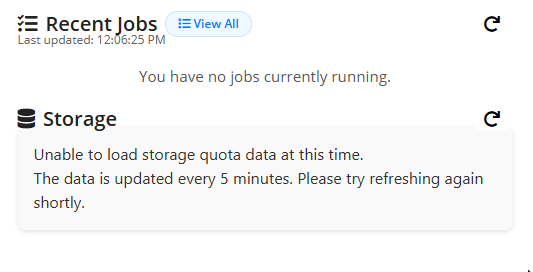
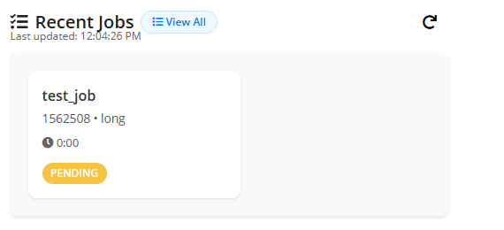
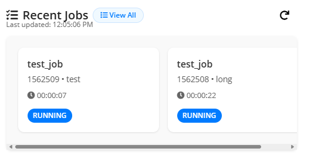

# OnDemand Recent Jobs Widget

## About






This repository contains a lightweight, transferable OnDemand recent jobs widget that consumes raw `squeue` output for the current user, extracts the latest jobs, and renders a concise visual summary including job name, partition, ID, state badge, and elapsed time (live-updating for running jobs). It’s built so other sites or dashboards can drop it in with minimal adjustments and surface user-specific job visibility consistently.

Key goals:
- **Simplicity:** Server-side injects `squeue` output; client-side JavaScript transforms it into cards.  
- **Transferability:** Minimal dependencies, clear heuristics for state-to-badge mapping, and overrideable styling.  
- **Live Feedback:** Running jobs show an updating timer; the widget shows “Last updated” for manual refreshes.  
- **Graceful Degradation:** Displays a friendly message when no jobs are present or if parsing fails.

## Installation

Clone the repository:

```bash
git clone https://github.com/NessieCanCode/ood_squeue_widget.git
cd ood_recent_jobs_widget
```

Place or customize the widget file (`_squeue.html.erb`) with any local adjustments (e.g., dashboard URLs, user resolution logic).

Create the symlink so OnDemand’s dashboard picks it up (adjust target path for your install):

```bash
ln -s _squeue.html.erb /etc/ood/config/apps/dashboard/views/widgets/_squeue.html.erb
```

## Usage

Embed the widget in your dashboard. On page load it:

1. Reads the embedded raw `squeue` output for the current user (via ERB).  
2. Parses job fields: job ID, name, partition, user, state, time, and nodes.  
3. Selects the most recent five jobs (newest first).  
4. Renders job cards with:
   - Name, ID, partition
   - State badge colored by status
   - Elapsed time (live-updating if running)
5. Updates the “Last updated” timestamp.  
6. Supports manual refresh via the refresh button (fetches the current page with no cache).

## CSS: Defaults & Overrides

Below are the core CSS rules this widget relies on; you can override them for branding or tweaks.

```css
/* Job card container and layout */
.job-card-container {
  overflow-x: auto;
  display: grid;
  grid-auto-flow: column;
  grid-template-rows: repeat(1, 1fr);
  grid-auto-columns: 255px;
  scroll-snap-type: x mandatory;
  -webkit-overflow-scrolling: touch;
  background-color: rgb(249, 249, 249);
  box-shadow: rgba(0, 0, 0, 0.1) 0px 2px 4px;
  scrollbar-width: thin;
  margin-bottom: 20px;
  padding: 20px;
  scroll-behavior: smooth;
  border-radius: 8px;
  margin-top: 10px;
  scrollbar-color: #888 #eee;
}
.job-card-container::-webkit-scrollbar {
  height: 8px;
}
.job-card-container::-webkit-scrollbar-track {
  background: #eee;
  border-radius: 4px;
}
.job-card-container::-webkit-scrollbar-thumb {
  background-color: #888;
  border-radius: 4px;
  transition: background-color 0.2s ease;
}
.job-card-container::-webkit-scrollbar-thumb:hover {
  background-color: #555;
}

/* Individual job card */
.job-card {
  background: #fff;
  border-radius: 10px;
  box-shadow: 0 1px 3px rgba(0,0,0,0.1);
  padding: 1rem;
  min-width: 220px;
  flex: 1;
  max-width: 240px;
  display: flex;
  flex-direction: column;
  justify-content: space-between;
}
.job-name {
  font-weight: 600;
  font-size: 1rem;
  margin-bottom: 0.25rem;
}
.job-meta {
  color: #555;
  font-size: 0.85rem;
  margin-bottom: 0.5rem;
}
.job-timestamp {
  font-size: 0.8rem;
  color: #666;
  margin-bottom: 0.75rem;
}
.job-status {
  display: flex;
  gap: 0.5rem;
}
.status-badge {
  font-size: 0.75rem;
  padding: 0.2rem 0.6rem;
  border-radius: 999px;
  font-weight: 600;
  color: white;
}
.status-badge.pending { background-color: #f6c343; }
.status-badge.running { background-color: #007bff; }
.status-badge.suspended { background-color: #6c757d; }
.status-badge.completing { background-color: #17a2b8; }
.status-badge.completed { background-color: #28a745; }
.status-badge.default { background-color: #999; }

/* Fallback / empty state */
.no-jobs-msg {
  padding: 1rem;
  background: #fff;
  border-radius: 10px;
  font-size: 0.95rem;
  text-align: center;
  color: #555;
}

/* Header / title / action styling reused from shared widget conventions */
.widget-header {
  display: flex;
  justify-content: space-between;
  align-items: center;
  font-size: 1.25rem;
  font-weight: 600;
  color: #222;
}
.widget-title {
  display: flex;
  align-items: center;
  gap: 0.5rem;
}
.widget-action {
  font-size: 1rem;
  padding: 0.2rem 0.8rem;
  border: none;
  background: white;
  border-radius: 999px;
  cursor: pointer;
  display: flex;
  align-items: center;
  gap: 0.4rem;
}
.announcement-viewall {
  font-size: 0.75rem;
  background: #f0f9ff;
  border: 1px solid #cce5ff;
  color: #007bff;
  padding: 0.2rem 0.75rem;
  border-radius: 999px;
  cursor: pointer;
  text-decoration: none;
  display: inline-flex;
  align-items: center;
  gap: 0.25rem;
}
.last-updated {
  font-size: 0.75rem;
  color: #666;
  margin-top: -0.5rem;
}
```

### Example Overrides

```css
/* Highlight running jobs more strongly */
.status-badge.running {
  background-color: #0056d6;
}

/* Different card background for pending */
.job-card.pending {
  background: #f9faff;
}
```

## Troubleshooting

- **No jobs shown:** Ensure `squeue` runs for the current user and that the ERB interpolation (`squeue -u ...`) is executing correctly.  
- **Incorrect parsing:** Confirm the format string (`-o "%i|%j|%P|%u|%T|%M|%D"`) produces pipe-separated fields and that the header line is present.  
- **Live timer not updating:** Check that the job state is "RUNNING" (case-insensitive) and that the initial time string splits into expected components.  
- **Refresh fails:** The widget fetches the current page with `{ cache: "no-store" }`; ensure the server isn’t aggressively caching and the DOM contains the expected `<pre>` on reload.

## Contributing

1. Fork the repository.  
2. Add features like configurable job count, filter support, or link-through to job details.  
3. Submit a pull request with sample `squeue` output and a description of your changes.

## License

MIT License — see the `LICENSE` file for details.
